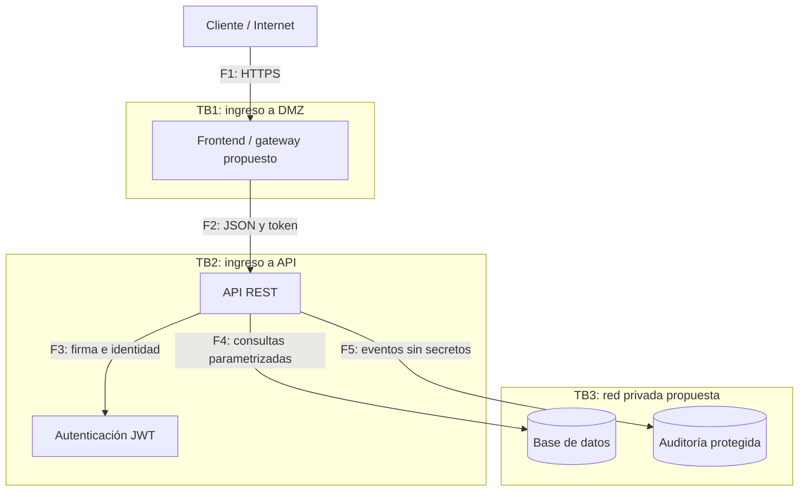

# Threat Model · SecureBank API

**MIDAMA · v1.0 · 01-10-2026 · Próxima revisión: 01-11-2026**, o antes si cambia autenticación, persistencia, CI o despliegue.

## Alcance, activos y supuestos

Se modela el escenario bancario simulado de las sesiones 1–3 y la base Node.js construida para la sesión 4. No hubo código vulnerable del docente disponible. Las debilidades de la tabla son hipótesis de diseño tomadas del material y no hallazgos demostrados en una instalación real.

Activos: credenciales y JWT, saldos ficticios, cuentas y movimientos, base de datos, secretos de CI, código y artefactos, evidencia de auditoría y disponibilidad. Actores: cliente legítimo, atacante externo, cliente malicioso, colaborador interno y proveedor comprometido. Un cliente autenticado continúa siendo no confiable para decidir dueño, monto o rol.

## DFD y fronteras de confianza

[DFD editable para Draw.io](semana-03/securebank-dfd.drawio). Abrir en diagrams.net mediante Archivo → Abrir desde dispositivo. Sus líneas azules punteadas delimitan las zonas propuestas.

En el laboratorio, frontend/gateway no se implementan, autenticación está dentro de la API, SQLite reside en el proceso y auditoría sale a stdout. Las tres fronteras describen el despliegue objetivo; aún no equivalen a segmentación física. F6 es el flujo adicional Git → runner CI → artefacto; el código de un PR no hereda confianza ni secretos.

| Frontera | Validaciones y controles |
|---|---|
| TB1 Internet → DMZ | TLS, límites, gateway/WAF; propuestas pendientes |
| TB2 DMZ → API | JWT, autorización por objeto, entradas JSON, límites y timeout |
| TB3 API → datos/operación | Consultas parametrizadas, transacciones; red privada, permisos DB y logs externos pendientes |

## Escala de riesgo

Probabilidad P: 1 baja (condiciones difíciles), 2 media (acceso y conocimiento moderados), 3 alta (abuso sencillo). Impacto I: 1 bajo, 2 medio (degradación o fuga limitada), 3 alto (fondos o datos masivos). Riesgo = P × I: 1–2 bajo, 3–4 medio, 6–9 alto. La puntuación es **inherente al escenario sin controles**, no un resultado de pentest. Revaluar riesgo residual al verificar los controles y la infraestructura.

## Amenazas y controles

| ID | STRIDE | Amenaza / flujo | Debilidad | P | I | P×I / prioridad | Control propuesto |
|---|---|---|---|---|---|---|---|
| T01 | S | Credenciales filtradas (F1/F2) | Contraseñas reutilizadas y ausencia de MFA | 3 | 3 | 9 / alto | Hash scrypt y límite de intentos; MFA y detección de credenciales filtradas pendientes |
| T02 | S | JWT falsificado (F2/F3) | Firma ausente, clave débil o algoritmo no restringido | 3 | 3 | 9 / alto | HS256 fijo, clave ≥32 bytes, emisor/audiencia/expiración y rol contra BD; RS256 y rotación administrada futuros |
| T03 | T | Monto alterado en tránsito (F1/F2) | HTTP fuera del laboratorio y validación insuficiente | 2 | 3 | 6 / alto | TLS/HSTS en gateway propuesto; entero CLP, límites y saldo en servidor |
| T04 | T | SQL Injection (F2/F4) | Consultas formadas por concatenación | 3 | 3 | 9 / alto | Prepared statements SQLite con parámetros; revisión y SAST futuros |
| T05 | R | Repudio de transferencia (F2/F5) | Ausencia de evidencia protegida o registros alterables | 2 | 3 | 6 / alto | Auditoría de eventos con fecha e identidad y hash encadenado; colector externo WORM y acceso segregado futuros |
| T06 | I | Lectura de cuenta ajena / IDOR (F2/F4) | Falta de autorización por objeto | 3 | 3 | 9 / alto | Comparar owner con identidad validada en cuenta y movimientos; UUID solo defensa complementaria |
| T07 | I | Secretos en historial Git (F6) | Credenciales versionadas y clones persistentes | 2 | 3 | 6 / alto | Gitleaks en push/PR, ignore y clave externa/efímera; revocar primero ante filtración |
| T08 | D | Fuerza bruta y saturación (F1/F2) | Ausencia de cuotas y trabajo criptográfico costoso | 3 | 2 | 6 / alto | Límite por IP, ventana y mapa acotado; gateway/WAF y cuotas por usuario futuros |
| T09 | D | Payload masivo (F2) | Cuerpo ilimitado y tiempos sin restricción | 2 | 2 | 4 / medio | Máximo 16 KiB JSON, timeout de petición 10 s y cabeceras 5 s |
| T10 | E | BOLA de transferencia (F2/F4) | Confiar en originAccount sin verificar dueño | 3 | 3 | 9 / alto | Validar propietario dentro de transacción; rechazar 403 y auditar; conservar saldos |
| T11 | E | Escalada a admin (F2/F3) | Aceptar role del registro o JWT sin validación | 3 | 3 | 9 / alto | Registro solo client, rol resuelto contra BD y firma obligatoria; rutas admin fuera de alcance |
| T12 | I | Datos sensibles en logs (F5) | Logs de tokens, contraseñas o PII completa | 2 | 2 | 4 / medio | Auditar solo evento, ID interno, resultado, fecha y hash; retención y acceso externo futuros |

Las seis categorías están cubiertas: S suplantación, T manipulación, R repudio, I divulgación, D denegación y E elevación. UUID no reemplaza autorización; cifrar el transporte no impide que el propio cliente envíe un monto abusivo; firmar un JWT no sustituye comprobar permisos en servidor.

## Caso POST /transfer: BOLA

Si B indica una cuenta de A como `originAccount` y el servidor confía en ese campo, puede debitar fondos ajenos. Categoría principal E; también compromete integridad. La API obtiene identidad de un JWT validado, consulta dueño dentro de la transacción y responde 403 con auditoría si no coincide. El control se prueba asegurando saldos y movimientos sin cambios. Para una operación válida, débito y crédito se confirman juntos; falta de saldo o destino invalida toda la operación.

## Historias y seguimiento

Cada amenaza tiene una historia SS01–SS12 y criterios verificables en el [backlog](semana-03/backlog.md). Las pruebas existentes se identifican como implementación parcial donde falta infraestructura. El equipo debe revisar riesgos residuales después del CI y antes de cualquier despliegue.
